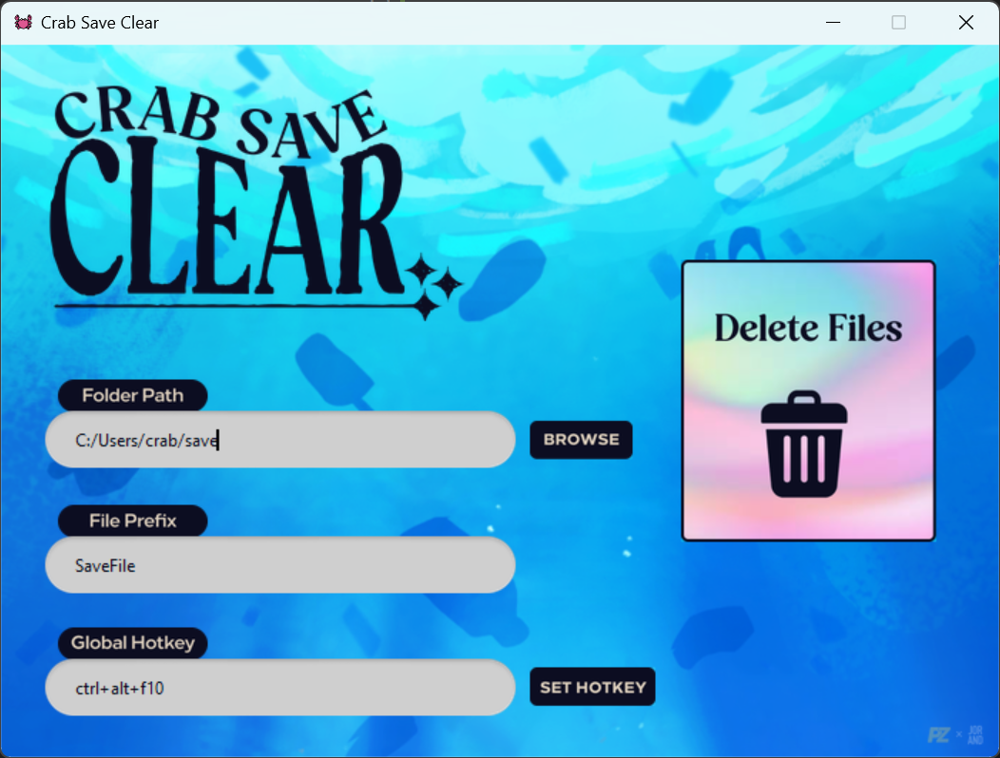

  

<h1 align="center">Crab Save Clear</h1>

Clear your saves in the game "Another Crab's Treasure". Use a hotkey or the clear button to move all the save to the trash bin.

  

## Usage

- Set path to your save folder
- Set prefix of the save files (ex:Save-)
- Set hotkey like "f14" or "ctrl+alt+f10"
- Click on the "Delete files" button of use you hotkey

To retrive your files the are moved to the system bin

## Download

**Download the lastest version from the dist folder or the [Releases page](https://github.com/PaoZDev/CrabSaveClear/releases).**

## Installation

Python and pip must be installed in your computer.

- `pip install -r requirements.txt`

## Build EXE Instructions

Install pyinstaller
- `pip install pyinstaller`

Build from spec
- `pyinstaller CrabSaveClear.spec`

Build
- `pyinstaller --onefile --windowed --noconsole --clean --icon=app.ico --name CrabSaveClear CRAB_SAVE_CLEAR.py`

## License
This project is licensed - see the LICENSE file for details